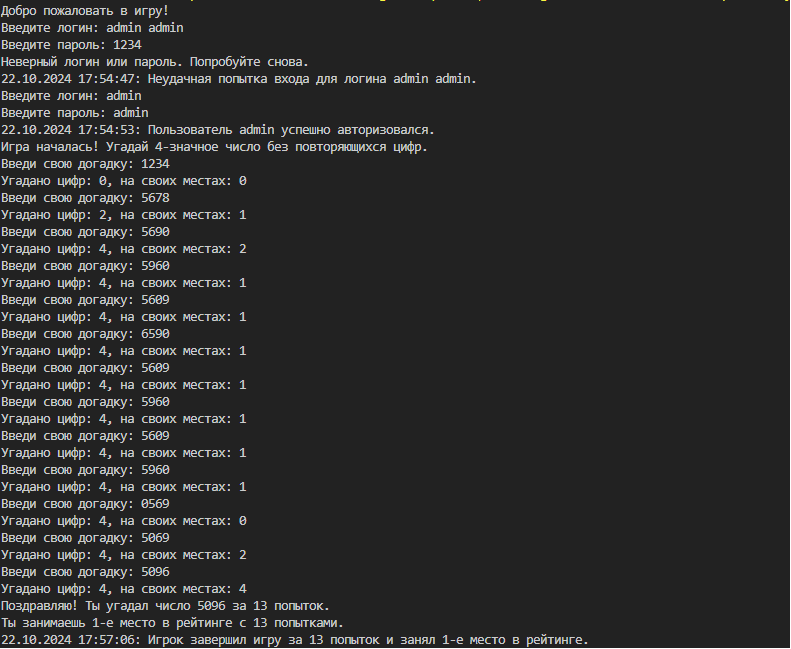

### Generate function for new number in my own game

```C#
static string GenerateNumber()
    {
        Random rand = new Random();
        string number = "";

        while (number.Length < 4)
        {
            int digit = rand.Next(0, 10);
            if (!number.Contains(digit.ToString()))
            {
                number += digit.ToString();
            }
        }
        return number;
    }
```

### If you want to start game. Just write `dotnet run`

### Example usage of application

